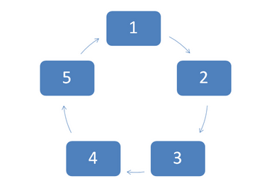
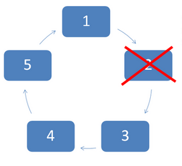
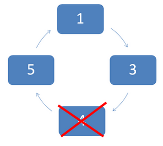
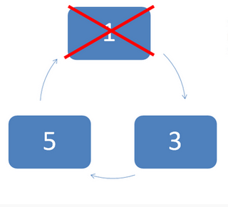
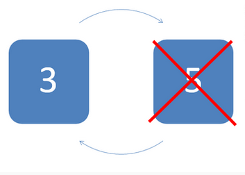

# Problema de Josephus - Circular Doubly Linked List

## Descripción del proyecto

Este programa resuelve el problema de Josephus utilizando una lista circular doblemente enlazada. El problema de
Josephus consiste en crear una lista circular de la cual solo quedará un elemento al final. En cada paso, el elemento
elimina al que se encuentre a 'k' posiciones a partir de él, y así sucesivamente. El valor mínimo de 'k' es 1, lo que
significa que el elemento elimina al que está a su lado.

El programa permite al usuario ingresar la cantidad de elementos en la lista y el valor de 'k'. Luego, el programa
calcula la posición que sobrevive después de las eliminaciones y muestra el resultado. También ofrece dos modos de
eliminación: sentido horario y sentido antihorario. Además, se le permite al usuario ingresar la posición que cree que
sobrevivirá y se le indica si su respuesta es correcta o no antes de proceder con las eliminaciones.

## Funcionalidades principales

- Crear una lista circular doblemente enlazada de N elementos.
- Realizar las eliminaciones según el valor de 'k' y el sentido (horario o antihorario) especificado por el usuario.
- Calcular la posición que sobrevive después de las eliminaciones.
- Permitir al usuario ingresar su suposición sobre la posición que sobrevivirá y verificar si es correcta antes de la
  eliminación.
- Mostrar una visualización gráfica de cómo se realizó la eliminación en la lista.

## Instrucciones de uso

1. Ejecutar el programa.
2. Ingresar la cantidad de elementos en la lista circular (N).
3. Ingresar el valor de 'k', que representa el paso con el que se realizarán las eliminaciones. El valor de 'k' debe ser
   mayor o igual a 1.
4. Seleccionar el sentido en el que se realizarán las eliminaciones:
    - 1: Sentido horario.
    - 2: Sentido antihorario.
5. Ingresar la posición que se cree que sobrevivirá después de las eliminaciones.
6. El programa calculará y mostrará la posición que sobrevive después de las eliminaciones y si la respuesta del usuario
   fue correcta o incorrecta.
7. Procede a realizar la eliminación en la lista circular.
8. Se mostrará una visualización gráfica de cómo se realizaron las eliminaciones en la lista. El número eliminado se
   mostrará en rojo.

## Ejemplo de ejecución

Con N = 5; K = 1











## Compilación y ejecución

1. Asegúrate de tener todos los archivos fuente (.cpp) y los archivos de encabezado (.h) en la misma carpeta.
2. Utiliza un compilador compatible con C++ para compilar el código.

Por ejemplo, teniendo instalado g++ en la línea de comandos, podria ejecutar el script de compilación de la siguiente
manera

```
./compile.sh
```

3. Sigue las instrucciones proporcionadas por el programa para interactuar con él y resolver el problema de Josephus.

---